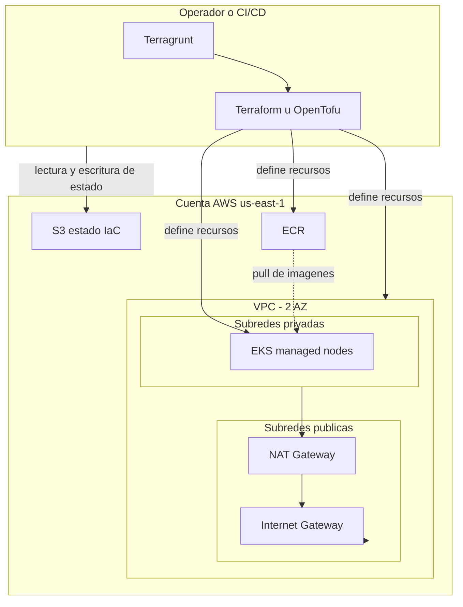
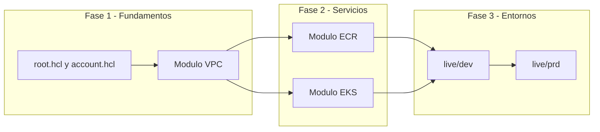
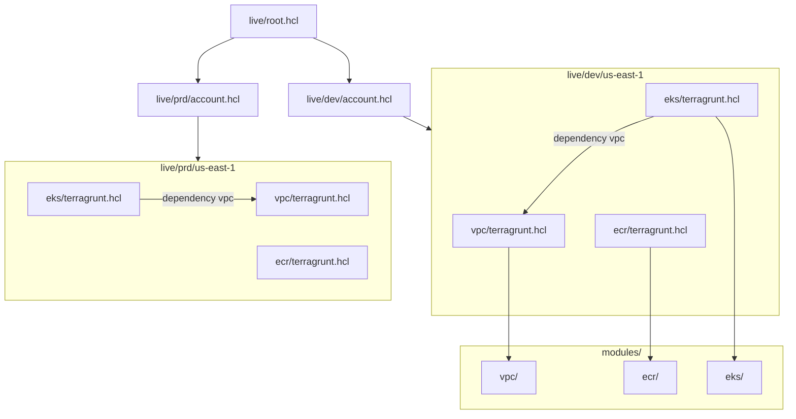
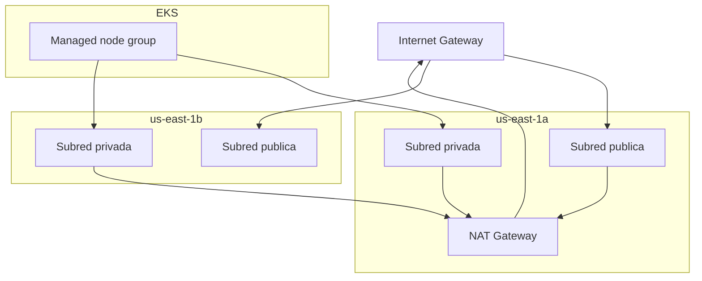
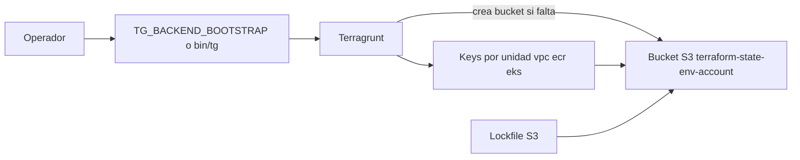
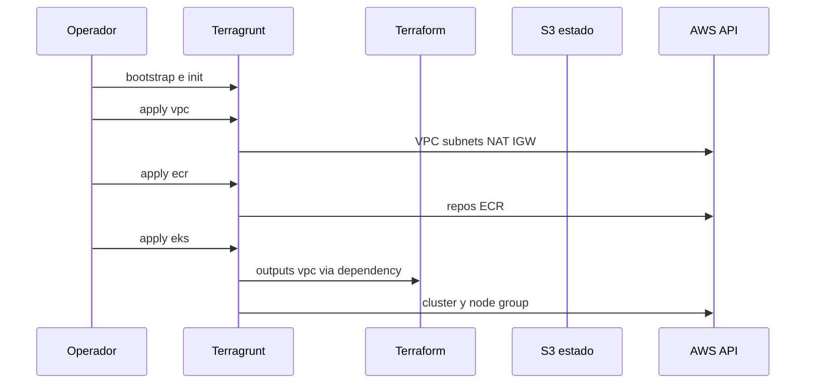

# Informe final – Lab 3: Infraestructura como código en la nube con Terraform

**Proyecto Integrador – Desarrollo de Laboratorios y Prácticas Iterativas en un Cloud Provider (AWS-UNC)**  
Referencia: Solicitud de Proyecto Integrador (`repositories/Solicitud-tema-PI.docx.md` / PDF modificado Mas-Mercau).

Repositorio de implementación: `ICOMP-UNC-pi-2025-Infra-lab3`.

---

## 1. Objetivo del laboratorio

Modelar en **AWS** una base de infraestructura **reproducible y versionada** para los entornos `dev` y `prd` en `us-east-1`, alineada al trabajo práctico del PI: aplicaciones **frontend y backend** en contenedores (Lab 1), desplegables sobre **Kubernetes (EKS)** con red (**VPC**) y registro de imágenes (**ECR**) gestionados como código.

Según la propuesta del PI:

> *"Laboratorio 3 – Infraestructura como código en la nube con Terraform. Se desplegará infraestructura en la nube (por ejemplo, AWS) primero de forma manual y luego usando Terraform, introduciendo conceptos como providers, recursos, variables y manejo del estado remoto."*

La implementación de este repositorio cumple y extiende ese objetivo mediante **Terragrunt** (orquestación de varias unidades), **módulos Terraform** reutilizables y **estado remoto en S3**, provisionando VPC, ECR y EKS en dos entornos.

### Diagrama de arquitectura global

*Recomendación: figura principal del informe / tesis. Fuente: [diagramas/arquitectura-lab3.mmd](diagramas/arquitectura-lab3.mmd).*



---

## 2. Tecnologías utilizadas

| Área | Tecnología | Uso en el Lab 3 |
|------|------------|-----------------|
| IaC | Terraform `>= 1.6` | Declaración de recursos AWS en módulos `.tf` |
| Orquestación | Terragrunt 1.x | Backend común, provider generado, dependencias entre unidades |
| Cloud | AWS | VPC, EKS, ECR, S3 (estado), IAM (roles EKS) |
| Módulos | terraform-aws-modules | `vpc/aws` ~5.0, `eks/aws` 20.31.0, `ecr/aws` ~2.0 |
| Estado | S3 + lockfile | `encrypt = true`, `use_lockfile = true` (sin DynamoDB) |
| Operación | AWS CLI, kubectl | Validación post-despliegue del clúster |
| Origen de imágenes | ECR (Lab 1) | Repos importados o creados por código |

---

## 3. Descripción de las tareas realizadas (paso a paso)

El trabajo sigue tres fases lógicas: fundamentos (root + módulos), servicios (VPC, ECR, EKS) y materialización por entorno (`live/dev`, `live/prd`).



### 3.1 Diseño de carpetas `modules/` vs `live/`

Se adoptó la separación habitual en proyectos IaC maduros:

| Carpeta | Rol |
|---------|-----|
| **`modules/`** | Definición reutilizable y agnóstica de entorno: qué recursos crear y qué outputs exponer. |
| **`live/`** | Valores concretos por entorno (`dev`, `prd`), región y unidad (vpc, ecr, eks). |

Cada unidad bajo `live/<env>/us-east-1/<unidad>/` incluye un `terragrunt.hcl` que apunta al módulo correspondiente en `modules/` y define `inputs` específicos.

*Recomendación: tras esta sección, incluir diagrama de jerarquía Terragrunt.*



### 3.2 Configuración común: `live/root.hcl`

**Paso 1 – Leer variables de cuenta.** Terragrunt carga `account.hcl` del entorno padre (`dev` o `prd`) para obtener `environment`, `aws_region`, `state_bucket` y `aws_account_id`.

**Paso 2 – Backend remoto S3.** Cada unidad guarda su estado en el bucket del entorno, con una key relativa a la ruta de la unidad:

- `encrypt = true`
- `use_lockfile = true` (bloqueo nativo en S3, sin tabla DynamoDB)

**Paso 3 – Provider AWS generado.** El bloque `generate "provider"` crea `provider.auto.tf` con:

- `region` desde `account.hcl`
- `allowed_account_ids` como guardrail anti-deploy cruzado
- `default_tags`: `Environment`, `ManagedBy = Terragrunt`, `Lab = lab3`
- Perfil y archivo de credenciales desde variables de entorno (`AWS_PROFILE`, `HOME`)

**Paso 4 – Compatibilidad SDK.** `AWS_STS_REGIONAL_ENDPOINTS = regional` en `extra_arguments` para comandos Terraform habituales.

### 3.3 Archivos `account.hcl` por entorno

| Entorno | `state_bucket` (ejemplo en repo) | Uso |
|---------|----------------------------------|-----|
| `dev` | `terraform-state-dev-<account-id>` | State aislado de desarrollo |
| `prd` | `terraform-state-prd-<account-id>` | State aislado de producción |

Ambos usan `aws_region = us-east-1` y el mismo `aws_account_id` en la implementación de tesis (cuenta de práctica); en un escenario real de producción conviene **cuentas AWS separadas** por entorno.

### 3.4 Módulo VPC (`modules/vpc`)

**Paso 1 – Wrapper sobre módulo community.** `main.tf` invoca `terraform-aws-modules/vpc/aws` con CIDR, AZs, subnets públicas/privadas, NAT y tags.

**Paso 2 – Requisito EKS: dos AZ.** En `live/dev/us-east-1/vpc/terragrunt.hcl` (y análogo en prd):

- `azs = ["us-east-1a", "us-east-1b"]`
- Subredes públicas: `10.10.1.0/24`, `10.10.3.0/24` (dev)
- Subredes privadas: `10.10.2.0/24`, `10.10.4.0/24` (dev)
- `enable_nat_gateway = true`, `single_nat_gateway = true` (costo acotado para lab)

**Paso 3 – Tags para load balancers de Kubernetes.** Subredes públicas: `kubernetes.io/role/elb = 1`. Privadas: `kubernetes.io/role/internal-elb = 1`.

**Paso 4 – Outputs.** El módulo expone `vpc_id`, `vpc_cidr_block`, `public_subnet_ids`, `private_subnet_ids` para consumo de EKS.

*Recomendación: figura de red tras esta sección.*



*[INSERTAR CAPTURA: consola AWS – VPC con subnets en 2 AZ y NAT Gateway]*

### 3.5 Módulo ECR (`modules/ecr`)

**Paso 1 – Un módulo por repositorio.** `for_each` sobre `var.repository_names` instancia `terraform-aws-modules/ecr/aws` por cada nombre.

**Paso 2 – Políticas.** Scan on push habilitado; lifecycle por defecto conserva las últimas **30** imágenes (`variables.tf`).

**Paso 3 – Integración con Lab 1.** En dev se gestionan los repos usados por el pipeline del TP:

- `b4c0c6w7/tesis/tp1-frontend`
- `b4c0c6w7/tesis/tp1-backend`

En prd, variantes con sufijo `-prd`.

**Paso 4 – Import de recursos existentes.** Si los repos ya existían por creación manual o Lab 1, se ejecutó `terragrunt import` (comandos en [README](../README.md)) para adoptarlos en el state sin destruirlos.

*[INSERTAR CAPTURA: consola ECR – repositorios con scan on push]*

### 3.6 Módulo EKS (`modules/eks`)

**Paso 1 – Clúster en subnets privadas.** Variables `vpc_id` y `subnet_ids` (privadas) conectan EKS con la VPC.

**Paso 2 – Versión y node group.** Kubernetes `1.35`; un **EKS managed node group** con tipos y escalado definidos en Terragrunt por entorno.

**Paso 3 – Acceso al API.** `cluster_endpoint_public_access = true` facilita operación desde estaciones de trabajo del lab.

**Paso 4 – Permisos del aplicador.** `enable_cluster_creator_admin_permissions = true` crea access entry de administrador para la identidad IAM que ejecuta `terragrunt apply`.

**Paso 5 – Optimización de costos (lab).** Se deshabilitaron logs de control plane en CloudWatch y cifrado KMS de secrets por defecto del módulo, reduciendo costo en entornos de práctica:

```hcl
cluster_enabled_log_types   = []
create_cloudwatch_log_group = false
cluster_encryption_config   = {}
```

**Paso 6 – Dependencia Terragrunt en EKS.** La unidad `eks` declara:

```hcl
dependency "vpc" {
  config_path = "../vpc"
}

inputs = {
  vpc_id     = dependency.vpc.outputs.vpc_id
  subnet_ids = dependency.vpc.outputs.private_subnet_ids
  # ...
}
```

### 3.7 Unidades Terragrunt – entorno `dev`

| Unidad | Parámetros destacados |
|--------|------------------------|
| **vpc** | `tp3-dev-vpc`, CIDR `10.10.0.0/16`, 2 AZ, NAT único |
| **ecr** | Repos `tp1-frontend`, `tp1-backend` (ruta completa con prefijo de cuenta/registry) |
| **eks** | `tp3-dev-eks`, `t3.small`, 1 nodo (min=max=desired=1), disco 20 GiB |

### 3.8 Unidades Terragrunt – entorno `prd`

| Recurso | dev | prd |
|---------|-----|-----|
| VPC nombre / CIDR | `tp3-dev-vpc` / `10.10.0.0/16` | `tp3-prd-vpc` / `10.20.0.0/16` |
| EKS / nodos | `tp3-dev-eks`, `t3.small`, 1 nodo | `tp3-prd-eks`, `t3.medium`, 2–4 nodos |
| ECR repos | `tp1-frontend`, `tp1-backend` | `tp1-frontend-prd`, `tp1-backend-prd` |
| State bucket | `terraform-state-dev-...` | `terraform-state-prd-...` |

*Recomendación: tabla comparativa dev/prd (arriba) como figura en el PDF.*

### 3.9 Bootstrap del backend y script `bin/tg`

Terragrunt 1.x **no crea** el bucket S3 de estado en un `plan` simple; hace falta **bootstrap** explícito:

- Variable `TG_BACKEND_BOOTSTRAP=true`, o
- `terragrunt run --all --backend-bootstrap init`, o
- Script `bin/tg` que ejecuta `terragrunt` con `TG_BACKEND_BOOTSTRAP=true` en el proceso hijo.



### 3.10 Orden de apply y `terragrunt run --all`

**Orden recomendado:**

1. `vpc`
2. `ecr` (en paralelo conceptual con eks una vez existe vpc)
3. `eks` (requiere outputs de vpc)

Desde `live/dev/us-east-1`:

```bash
export TG_BACKEND_BOOTSTRAP=true   # primera vez
terragrunt run --all init
terragrunt run --all plan
terragrunt run --all apply
```

Terragrunt respeta `dependency` de eks sobre vpc al resolver el grafo.



### 3.11 Validación post-despliegue

1. `terragrunt output` en unidad vpc / eks.
2. `aws eks update-kubeconfig --region us-east-1 --name tp3-dev-eks` (o prd).
3. Misma identidad IAM que ejecutó el apply: `aws sts get-caller-identity`.
4. `kubectl get nodes` — debe listar nodos Ready.

Si `kubectl` pide credenciales pese a `get-token` OK, revisar **access entries** (identidad distinta a la del apply). Ver README del repo.

**Checklist de evidencia**

| Verificación | Comando / acción | Evidencia |
|--------------|------------------|-----------|
| State en S3 | Listar bucket y keys | [INSERTAR CAPTURA: S3 bucket y objetos .tfstate] |
| Plan limpio | `terragrunt plan` en cada unidad | [INSERTAR CAPTURA: plan sin cambios o cambios esperados] |
| Nodos EKS | `kubectl get nodes` | [INSERTAR CAPTURA: nodos Ready] |
| Repos ECR | Consola o `aws ecr describe-repositories` | [INSERTAR CAPTURA: repos del TP] |

---

## 4. Justificación y decisiones de diseño

| Decisión | Justificación |
|----------|---------------|
| **Terragrunt además de Terraform** | Evita duplicar backend y provider en cada unidad; modela dependencias (EKS → VPC) sin `terraform_remote_state` manual en cada módulo. |
| **Módulos community** | Aceleran el lab, incorporan buenas prácticas AWS (tags ELB, IAM EKS) y reducen errores en recursos de bajo nivel. |
| **Dos entornos dev/prd** | Refleja promoción de cambios y separación de state; CIDR distintos evitan solapamiento en la misma cuenta. |
| **NAT único (`single_nat_gateway`)** | Menor costo para práctica; en producción se evaluaría NAT por AZ. |
| **Endpoint público del API EKS** | Simplifica acceso desde notebooks de alumnos; en producción podría restringirse a redes privadas + VPN. |
| **Import ECR** | Los repos del Lab 1 ya existían; import evita recreación y pérdida de imágenes. |
| **Lockfile S3 sin DynamoDB** | Menos componentes que mantener; alineado a Terragrunt 1.x con `use_lockfile`. |
| **Deshabilitar logs/KMS EKS en lab** | Reduce costo mensual; documentado como trade-off consciente, no como recomendación de producción. |
| **`allowed_account_ids`** | Falla rápido si las credenciales apuntan a otra cuenta al trabajar en `live/dev` vs `live/prd`. |

---

## 5. Marco teórico – conceptos cloud e IaC utilizados

Resumen ampliado en [marco-conceptual-lab3.md](marco-conceptual-lab3.md). A continuación, los ejes centrales para el informe de tesis.

### 5.1 Infraestructura como código (IaC)

**IaC** trata la infraestructura (redes, clústeres, registros) como **software**: archivos declarativos, revisión en Git, planes revisables y aplicación automatizada. Resuelve la deriva entre “lo que hay en la consola” y “lo que el equipo cree que hay”, y permite reproducir entornos.

### 5.2 Terraform: plan, apply y estado

**Terraform** lee configuración HCL, construye un grafo de dependencias, compara con el **estado** (mapa recurso lógico → ID en AWS) y produce un **plan** de cambios. **Apply** ejecuta ese plan. Sin estado consistente, no puede decidir de forma idempotente si debe crear o actualizar.

### 5.3 Terragrunt

**Terragrunt** envuelve Terraform para **DRY**: un `root.hcl` define backend y provider; carpetas `live/...` son unidades independientes con state separado; bloques `dependency` propagan outputs entre unidades.

### 5.4 Providers, variables y outputs

- **Provider**: plugin que habla con AWS (`aws`).
- **Variables**: parametrizan módulos sin copiar `.tf`.
- **Outputs**: contrato entre módulos (VPC entrega `private_subnet_ids` a EKS).

### 5.5 Estado remoto y bloqueo

El state en **S3** permite trabajo en equipo y CI; el **cifrado** y el **lock** evitan applies concurrentes que corrompan el state. En este lab: `use_lockfile` en el mismo bucket.

### 5.6 VPC, subnets, NAT e IGW

La **VPC** aísla la red; **subredes públicas** enrutan a **Internet Gateway**; **privadas** usan **NAT** para salida sin IP pública en workloads. EKS en privadas reduce exposición de nodos.

### 5.7 Amazon EKS

**EKS** ofrece Kubernetes administrado: AWS opera el plano de control; los **managed node groups** son workers en EC2. IAM, security groups y OIDC (IRSA) integran identidad y red.

### 5.8 Amazon ECR

**ECR** almacena imágenes OCI/Docker. CI (Lab 1) hace push; EKS hace pull al desplegar pods (Labs 2 y 4).

### 5.9 Drift e import

**Drift** ocurre cuando la realidad en AWS difiere del código. **`terraform import`** (vía Terragrunt) incorpora recursos preexistentes al state para gestionarlos sin recrearlos.

### 5.10 Tabla resumen – recursos por unidad

| Unidad | Recursos principales (conceptual) |
|--------|-----------------------------------|
| **VPC** | VPC, subnets, IGW, NAT, route tables, tags |
| **ECR** | Repositorios, lifecycle, scan on push |
| **EKS** | Cluster, node group, IAM roles, security groups, OIDC (según módulo) |

---

## 6. Conclusión

El Lab 3 cumple y amplía lo establecido en la Solicitud del PI: la infraestructura en AWS queda **declarada en código**, con **providers, variables, recursos y estado remoto**, aplicada de forma controlada mediante **plan/apply**. La base **VPC + ECR + EKS** en entornos `dev` y `prd` conecta con el **Lab 1** (imágenes en ECR) y habilita los **Labs 4–6** (Helm, observabilidad, CI/CD completo sobre el mismo clúster).

Documentación relacionada en este repositorio:

- [guia-y-consignas-lab3.md](guia-y-consignas-lab3.md)
- [entregables-lab3.md](entregables-lab3.md)
- [marco-conceptual-lab3.md](marco-conceptual-lab3.md)
- [README](../README.md)

---

*Informe de referencia – implementación ICOMP-UNC-pi-2025-Infra-lab3. Completar capturas marcadas como [INSERTAR CAPTURA] al exportar a PDF para entrega académica.*
