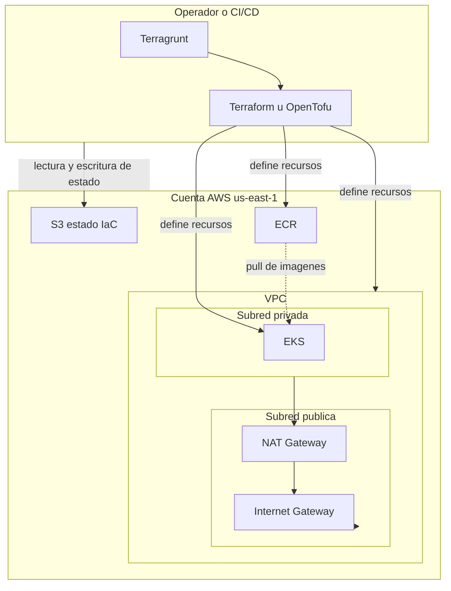

# Lab 3 — Marco conceptual (informe / tesis)

Documento de **alto nivel** para el trabajo práctico: qué rol cumple cada pieza de la infraestructura definida en código. Los comandos, prerequisitos y procedimientos operativos están en el [README](../README.md) del repositorio.

## Propósito del laboratorio

El laboratorio modela en **AWS** una base reproducible para los entornos `dev` y `prd` en la región `us-east-1`, alineada al TP: aplicaciones **frontend y backend** empaquetadas como contenedores, con un **clúster Kubernetes (EKS)** sobre una **red (VPC)** acotada y un **registro de imágenes (ECR)**. La meta es versionar la infraestructura igual que el código de aplicación y poder recrear o evolucionar entornos de forma controlada.

## Terraform

**Terraform** (u OpenTofu) es el motor que **declara** recursos en la nube (VPC, EKS, ECR, etc.) en archivos `.tf`, calcula un **plan** de cambios y los **aplica**. Mantiene un **estado** que asocia los identificadores en AWS con los recursos del código; sin estado consistente no puede saber qué crear, actualizar o destruir de forma segura.

## Terragrunt

**Terragrunt** no sustituye a Terraform: **orquesta** varias “unidades” (carpetas bajo `live/…`) que comparten configuración común (`root.hcl`, `account.hcl`). Centraliza el **backend remoto** (dónde se guarda el estado), inyecta el **provider** AWS y expresa **dependencias** entre unidades (por ejemplo, EKS obtiene `vpc_id` y subnets desde la unidad `vpc` mediante un bloque `dependency`). Así se evita repetir bloques y se mantiene un orden lógico entre módulos.

## Estado remoto (S3)

El estado no vive solo en la máquina del desarrollador: se persiste en un **bucket S3**, con **cifrado** y bloqueo mediante **lockfile en S3** (`use_lockfile` en la configuración de backend), sin tabla DynamoDB dedicada. En **Terragrunt 1.x**, la creación inicial del bucket de estado suele requerir un paso explícito de **bootstrap** del backend (variable de entorno o flag); el detalle operativo está en el README.

## VPC (red)

Una **VPC** es una red virtual aislada dentro de la cuenta, con un rango de direcciones (**CIDR**) propio. En este lab hay **subredes públicas y privadas en al menos dos zonas de disponibilidad** (`us-east-1a` y `us-east-1b`), requisito de EKS para alta disponibilidad del plano de datos.

- La subred **pública** concentra recursos que necesitan ruta directa hacia Internet, en particular el **NAT Gateway** (y la asociación con la **tabla de rutas** correspondiente).
- La subred **privada** aloja cargas que no deben exponer IPs públicas (por ejemplo nodos de EKS). El tráfico saliente hacia Internet sale por el **NAT**, de modo que los workloads privados no reciben tráfico entrante arbitrario desde Internet por esa vía.
- El **Internet Gateway** conecta la VPC con Internet para las rutas que lo requieran (públicas / NAT).

Los recursos **por defecto** de AWS en la VPC (por ejemplo NACL por defecto, route table por defecto, security group por defecto) pueden quedar **gestionados explícitamente** por el módulo de VPC; en el informe basta con indicar que reflejan una política de red y etiquetado coherentes con el resto del proyecto, sin enumerar cada regla del plan.

### Recursos típicos que crea la unidad VPC (resumen)

| Idea | Qué es (breve) |
|------|----------------|
| **VPC** | Contenedor lógico de red con CIDR propio. |
| **Subredes públicas y privadas** | Segmentos IP en una o más zonas; las públicas reciben ruta hacia el IGW (o alojan el NAT); las privadas no tienen esa ruta directa. |
| **Internet Gateway (IGW)** | Punto de salida/entrada entre la VPC e Internet para rutas públicas. |
| **Elastic IP + NAT Gateway** | IP fija en la subred pública; el NAT permite que instancias en subredes **privadas** inicien conexiones salientes a Internet sin IP pública propia. |
| **Tablas de rutas y asociaciones** | Definen el próximo salto (IGW, NAT, local) según destino; se asocian a cada subred. |
| **Rutas explícitas** | Por ejemplo `0.0.0.0/0` hacia IGW en públicas y hacia NAT en privadas. |
| **Defaults gestionados** | NACL por defecto, tabla de rutas por defecto y security group por defecto de la VPC, a veces materializados como recursos Terraform para fijar etiquetas y evitar sorpresas. |

## Amazon EKS

**EKS** es el servicio administrado de **Kubernetes** en AWS: el **plan de control** (API server, etcd, schedulers) lo opera AWS; los **nodos** (en este lab, un **EKS managed node group**) corren en las **subredes privadas** que entrega la unidad VPC. El clúster **depende** de la VPC: consume `vpc_id` y los IDs de subred privada para registrar el plano de datos y los workers en la red del lab.

### Recursos típicos que crea la unidad EKS (resumen)

Estos bloques aparecen en el plan de Terraform del módulo community `terraform-aws-modules/eks`; sirven para el informe sin copiar el listado completo de reglas ni ARNs.

| Bloque | Rol |
|--------|-----|
| **`aws_eks_cluster`** | El clúster en sí: versión de Kubernetes, subredes del API/data plane, acceso al endpoint (público/privado), integración con IAM. |
| **`aws_eks_node_group` (managed)** | Grupo de nodos administrado por AWS: tamaño deseado/mín/máx, tipos de instancia, AMI compatible con la versión del clúster; los nodos se crean en las subredes indicadas. |
| **`aws_launch_template`** | Plantilla de lanzamiento asociada al node group (por ejemplo metadatos IMDSv2, monitoreo, etiquetas en ENI/volúmenes). |
| **IAM: rol del clúster** | Rol que asume el servicio EKS para crear ENIs, ELB y otros recursos en tu cuenta; lleva políticas administradas de AWS (`AmazonEKSClusterPolicy`, etc.) y políticas extra si el módulo habilita cifrado u otras funciones. |
| **IAM: rol de los nodos** | Rol EC2 para los workers; políticas estándar (`AmazonEKSWorkerNodePolicy`, CNI, lectura de ECR) para unirse al clúster y tirar imágenes. |
| **`aws_security_group` (cluster y node)** | Firewalls a nivel de ENI: uno para el plano del clúster y otro compartido por nodos; **reglas** permiten tráfico entre API y kubelets, CoreDNS entre nodos, egress amplio desde nodos hacia Internet (actualizaciones, imágenes), etc. |
| **KMS (`aws_kms_key` + alias)** | Clave para **cifrar secretos de Kubernetes** (y configuración asociada del módulo); rota según la política definida. |
| **`aws_cloudwatch_log_group`** | Logs del plano de control (por ejemplo API, auditoría, autenticador) con retención acotada; útil para auditoría y depuración. |
| **`aws_iam_openid_connect_provider`** | Emisor OIDC del clúster; base para **IRSA** (pods con identidad IAM vía `AssumeRoleWithWebIdentity`). |
| **Políticas IAM ad-hoc** | Documentos que el módulo adjunta al rol del clúster (p. ej. permisos de cifrado sobre la clave KMS, o políticas “custom” de versiones recientes del módulo para integraciones ELB/compute). |
| **Etiquetas en el security group “primary” del clúster** | Recursos `aws_ec2_tag` para alinear el SG por defecto del clúster con tus tags de proyecto/entorno. |
| **Recursos de apoyo** | Por ejemplo `time_sleep` o `null_resource` para respetar dependencias y tiempos de propagación entre creación del clúster y del node group. |

En conjunto, la VPC aporta **conectividad y aislamiento**; EKS aporta **orquestación de contenedores** más **identidad, cifrado y observabilidad mínima** del plano de control según la configuración del módulo.

## Amazon ECR

**ECR** es el **registro de imágenes** (equivalente a un Docker registry en la cuenta AWS). Las imágenes del frontend y del backend se construyen en desarrollo o en CI y se publican en ECR; los manifiestos en Kubernetes en EKS referencian esas imágenes para desplegar los pods. ECR y EKS son complementarios: uno almacena artefactos, el otro ejecuta cargas de trabajo.

## Orden lógico de despliegue

1. **VPC**: define red, rutas y NAT; es prerequisito de EKS.
2. **ECR** y **EKS**: conceptualmente pueden avanzar en paralelo una vez exista la VPC; en la práctica EKS **solo puede aplicarse** cuando la unidad VPC ya fue aplicada y expone los outputs que consume Terragrunt.

## Diagrama de arquitectura

El siguiente diagrama resume el flujo **IaC → cuenta AWS** y la relación entre red, clúster e imágenes. Las flechas sólidas indican provisión o uso principal; la línea punteada sugiere el flujo de **consumo de imágenes** hacia el clúster.

Para el documento final de la tesis podés exportar el diagrama desde cualquier visor Mermaid o capturar la figura desde GitHub / el IDE si renderiza Markdown. Diagramas adicionales en [diagramas/](diagramas/).

## Documentación del laboratorio

| Documento | Uso |
|-----------|-----|
| [guia-y-consignas-lab3.md](guia-y-consignas-lab3.md) | Guía de trabajo y consignas para alumnos |
| [entregables-lab3.md](entregables-lab3.md) | Definición formal de entregables y criterios de aceptación |
| [informe-final-lab3.md](informe-final-lab3.md) | Informe final: implementación paso a paso, decisiones y marco teórico ampliado |
