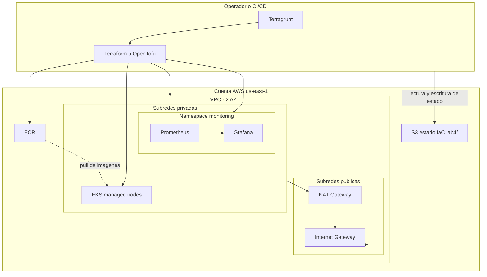
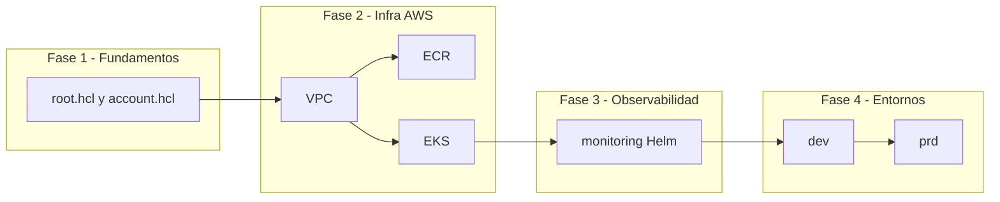
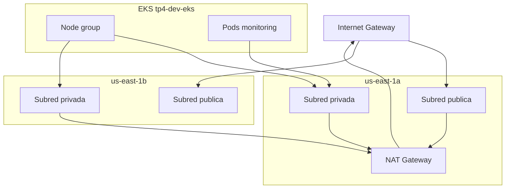
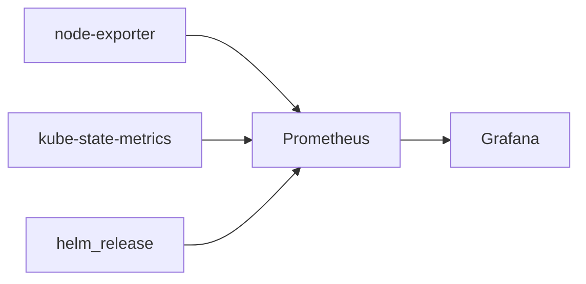

# Informe final – Lab 4: Clúster EKS y monitoreo con Grafana y Prometheus

**Proyecto Integrador – Desarrollo de Laboratorios y Prácticas Iterativas en un Cloud Provider (AWS-UNC)**  
Referencia: Solicitud de Proyecto Integrador (`repositories/Solicitud-tema-PI.docx.md`).

Repositorio de implementación: `ICOMP-UNC-pi-2025-Infra-lab4`.

Documentación relacionada: [guía y consignas](guia-y-consignas-lab4.md), [entregables](entregables-lab4.md), [README](../README.md), [diagramas](diagramas/).

---

## 1. Objetivo del laboratorio

Extender la base de infraestructura del **Lab 3** (VPC, ECR, EKS en `dev` y `prd`) con **observabilidad en el clúster**: instalar mediante **IaC** el chart **kube-prometheus-stack**, que despliega **Prometheus**, **Grafana**, **Alertmanager** y exporters, alineado al trabajo práctico del PI (aplicaciones containerizadas del Lab 1, desplegables sobre EKS).

Según la propuesta del PI:

> *"Laboratorio 4 – Creación de un clúster EKS y monitoreo con Grafana y Prometheus. Se desplegará un clúster de EKS (Elastic Kubernetes Service) usando Terraform, integrando charts de Helm al IaC para desplegar recursos de Kubernetes."*

La implementación de este repositorio cumple ese objetivo mediante **Terragrunt** (cuatro unidades por entorno), **módulos Terraform** reutilizables y el **provider Helm** para materializar workloads de Kubernetes como código versionado.

### Diagrama de arquitectura global

*Figura principal del informe. Fuente editable: [diagramas/arquitectura-lab4.mmd](diagramas/arquitectura-lab4.mmd).*



---

## 2. Tecnologías utilizadas

| Área | Tecnología | Uso en el Lab 4 |
|------|------------|-----------------|
| IaC | Terraform `>= 1.6` | Recursos AWS y `helm_release` en módulos `.tf` |
| Orquestación | Terragrunt 1.x | Backend común, provider AWS/Helm generados, dependencias |
| Cloud | AWS | VPC, EKS, ECR, S3 (estado), IAM (roles EKS) |
| Kubernetes | Amazon EKS `1.35` | Plano de control gestionado y node groups |
| Paquetes K8s | Helm (provider Terraform) | Instalación de `kube-prometheus-stack` |
| Observabilidad | Prometheus, Grafana, Alertmanager | Métricas, dashboards y alertas (chart community) |
| Módulos AWS | terraform-aws-modules | `vpc/aws` ~5.0, `eks/aws` 20.31.0, `ecr/aws` ~2.0 |
| Estado | S3 + lockfile | Keys con prefijo `lab4/` |
| Operación | AWS CLI, kubectl | Validación del clúster y del namespace `monitoring` |
| Origen de imágenes | ECR (Lab 1) | Repos del TP frontend/backend |

---

## 3. Descripción de las tareas realizadas (paso a paso)

El trabajo sigue cuatro fases: fundamentos (`root.hcl`), infraestructura AWS (VPC, ECR, EKS), observabilidad (monitoring) y materialización por entorno (`dev`, `prd`).



### 3.1 Relación Lab 3 → Lab 4

| Aspecto | Lab 3 | Lab 4 |
|---------|-------|-------|
| Módulos AWS | `vpc`, `ecr`, `eks` | Los mismos + **`monitoring`** |
| Naming | `tp3-*`, tag `Lab = lab3` | `tp4-*`, tag `Lab = lab4` |
| State key S3 | `dev/us-east-1/.../terraform.tfstate` | `lab4/dev/us-east-1/.../terraform.tfstate` |
| Workloads en K8s | No en IaC | **Helm chart** en Terraform |
| Objetivo PI | IaC base en AWS | EKS + **Grafana/Prometheus** en IaC |

El Lab 4 **no reemplaza** al Lab 3: lo **hereda** y añade la capa de monitoreo pedida en la Solicitud del PI, preparando Labs 5–6 (feature flags, CI/CD completo con métricas DORA).

### 3.2 Configuración común: `live/root.hcl`

**Paso 1 – Variables de cuenta.** Terragrunt lee `account.hcl` del entorno (`dev` o `prd`) para `environment`, `aws_region`, `state_bucket` y `aws_account_id`.

**Paso 2 – Backend remoto S3 con prefijo `lab4/`.** Evita colisión de state con el Lab 3 si comparten buckets:

```hcl
key = "lab4/${path_relative_to_include()}/terraform.tfstate"
```

**Paso 3 – Provider AWS generado** con `allowed_account_ids`, `default_tags` (`Environment`, `ManagedBy`, **`Lab = lab4`**) y perfil desde `AWS_PROFILE`.

**Paso 4 – STS regional** para compatibilidad con AWS provider 5.x (`AWS_STS_REGIONAL_ENDPOINTS = regional`).

### 3.3 Archivos `account.hcl` por entorno

| Entorno | `state_bucket` (convención) | Región |
|---------|-----------------------------|--------|
| `dev` | `terraform-state-dev-<account-id>` | `us-east-1` |
| `prd` | `terraform-state-prd-<account-id>` | `us-east-1` |

La implementación de tesis usa la misma `aws_account_id` en ambos entornos (cuenta de práctica); en producción real se recomiendan **cuentas AWS separadas**.

### 3.4 Módulo VPC (`modules/vpc`)

**Paso 1 – Módulo community** `terraform-aws-modules/vpc/aws` con CIDR, dos AZ, subnets públicas/privadas y NAT.

**Paso 2 – Parámetros en dev** (`live/dev/us-east-1/vpc/terragrunt.hcl`):

- Nombre: `tp4-dev-vpc`
- CIDR: `10.10.0.0/16`
- AZs: `us-east-1a`, `us-east-1b`
- Subredes públicas: `10.10.1.0/24`, `10.10.3.0/24`
- Subredes privadas: `10.10.2.0/24`, `10.10.4.0/24`
- `single_nat_gateway = true` (costo acotado)

**Paso 3 – Parámetros en prd:** CIDR `10.20.0.0/16` y subnets `10.20.x.0/24` (misma topología, distinto espacio de direcciones).

**Paso 4 – Tags EKS** en subnets para ELB interno/externo.

*Figura de red: [diagramas/red-vpc-eks-lab4.mmd](diagramas/red-vpc-eks-lab4.mmd).*



*[INSERTAR CAPTURA: consola AWS – VPC tp4-dev-vpc con 2 AZ y NAT]*

### 3.5 Módulo ECR (`modules/ecr`)

**Paso 1 – Repositorios** vía `for_each` sobre `repository_names` con módulo `terraform-aws-modules/ecr/aws`.

**Paso 2 – Dev:** repos del Lab 1 (`b4c0c6w7/tesis/tp1-frontend`, `tp1-backend`); **prd:** sufijo `-prd`.

**Paso 3 – Políticas:** `scan_on_push = true`, lifecycle (últimas 30 imágenes por defecto en el módulo).

**Paso 4 – Import** si los repos ya existían (comandos en [README](../README.md)).

*[INSERTAR CAPTURA: consola ECR – repositorios del TP]*

### 3.6 Módulo EKS (`modules/eks`)

**Paso 1 – Clúster** en subnets **privadas** con `dependency "vpc"` en Terragrunt.

**Paso 2 – Versión** Kubernetes `1.35`; endpoint público habilitado para operación desde estaciones del lab.

**Paso 3 – Permisos:** `enable_cluster_creator_admin_permissions = true` para la identidad IAM del apply.

**Paso 4 – Costos (lab):** sin logs de control plane en CloudWatch ni KMS de secrets por defecto del módulo:

```1:19:repositories/labs/lab4/ICOMP-UNC-pi-2025-Infra-lab4/modules/eks/main.tf
module "eks" {
  source  = "terraform-aws-modules/eks/aws"
  version = "20.31.0"
  # ...
  cluster_enabled_log_types   = []
  create_cloudwatch_log_group = false
  cluster_encryption_config   = {}
```

**Paso 5 – Capacidad por entorno:**

| Parámetro | dev (`tp4-dev-eks`) | prd (`tp4-prd-eks`) |
|-----------|---------------------|---------------------|
| Tipo instancia | `t3.small` | `t3.medium` |
| desired / min / max | 1 / 1 / 1 | 2 / 2 / 4 |
| Disco (GiB) | 20 | 20 (default) |

**Paso 6 – Acceso post-apply:**

```bash
aws eks update-kubeconfig --region us-east-1 --name tp4-dev-eks
kubectl get nodes
```

*[INSERTAR CAPTURA: salida kubectl get nodes – estado Ready]*

### 3.7 Módulo monitoring (`modules/monitoring`)

**Paso 1 – Recurso principal:** `helm_release` del chart `kube-prometheus-stack` (repositorio Prometheus Community), versión configurable (default `69.3.2` en variables).

```1:17:repositories/labs/lab4/ICOMP-UNC-pi-2025-Infra-lab4/modules/monitoring/main.tf
resource "helm_release" "kube_prometheus_stack" {
  name             = "kube-prometheus-stack"
  repository       = "https://prometheus-community.github.io/helm-charts"
  chart            = "kube-prometheus-stack"
  namespace        = var.namespace
  create_namespace = true
  # ...
  timeout = 600
}
```

**Paso 2 – Contraseña Grafana** con `set_sensitive` (no en el archivo values en claro):

```hcl
set_sensitive {
  name  = "grafana.adminPassword"
  value = var.grafana_admin_password
}
```

**Paso 3 – Values de laboratorio** (`values/monitoring.yaml`):

- Grafana: sin PVC (`persistence.enabled: false`), `ClusterIP`, timezone `America/Argentina/Cordoba`
- Prometheus: retención **1 día**, requests/limits bajos para nodos `t3.small`
- `nodeExporter` y `kubeStateMetrics` habilitados
- Alertmanager con recursos mínimos

**Paso 4 – Outputs:** nombres de servicios Grafana/Prometheus y namespace.

### 3.8 Unidad Terragrunt `monitoring` y provider Helm

**Paso 1 – Sin `dependency` a EKS en Terragrunt.** La unidad no lee el state de `eks`; en su lugar **genera** el provider Helm con data sources de AWS:

```15:34:repositories/labs/lab4/ICOMP-UNC-pi-2025-Infra-lab4/live/dev/us-east-1/monitoring/terragrunt.hcl
generate "helm_provider" {
  path      = "helm_provider.auto.tf"
  if_exists = "overwrite_terragrunt"
  contents  = <<-EOF
data "aws_eks_cluster" "this" {
  name = "${local.cluster_name}"
}
data "aws_eks_cluster_auth" "this" {
  name = "${local.cluster_name}"
}
provider "helm" {
  kubernetes {
    host                   = data.aws_eks_cluster.this.endpoint
    cluster_ca_certificate = base64decode(data.aws_eks_cluster.this.certificate_authority[0].data)
    token                  = data.aws_eks_cluster_auth.this.token
  }
}
EOF
}
```

**Paso 2 – `local.cluster_name`** debe coincidir con el clúster creado en la unidad `eks` (`tp4-dev-eks` / `tp4-prd-eks`).

**Paso 3 – Contraseñas en inputs (solo lab):** `admin` en dev, `changeme-prd` en prd — documentar riesgo en §4.

*Figura del stack: [diagramas/stack-observabilidad-lab4.mmd](diagramas/stack-observabilidad-lab4.mmd).*



### 3.9 Jerarquía `live/` y comparativa dev / prd

*Fuente: [diagramas/jerarquia-terragrunt-lab4.mmd](diagramas/jerarquia-terragrunt-lab4.mmd).*

| Dimensión | dev | prd |
|-----------|-----|-----|
| VPC CIDR | `10.10.0.0/16` | `10.20.0.0/16` |
| Cluster | `tp4-dev-eks` | `tp4-prd-eks` |
| Nodos EKS | 1× `t3.small` | 2–4× `t3.medium` |
| ECR | sin sufijo `-prd` | repos `*-prd` |
| Grafana password | `admin` | `changeme-prd` |
| State bucket | `terraform-state-dev-...` | `terraform-state-prd-...` |
| Tag `Project` | `tp4` | `tp4` |

Estructura simétrica: cuatro carpetas bajo `live/<env>/us-east-1/` (`vpc`, `ecr`, `eks`, `monitoring`).

### 3.10 Orden de apply y comandos

*Secuencia: [diagramas/secuencia-despliegue-lab4.mmd](diagramas/secuencia-despliegue-lab4.mmd).*

**Fase A – Infraestructura AWS (sin monitoring):**

```bash
cd live/dev/us-east-1
export TG_BACKEND_BOOTSTRAP=true
terragrunt run --all init --terragrunt-exclude-dir monitoring
terragrunt run --all plan --terragrunt-exclude-dir monitoring
terragrunt run --all apply --terragrunt-exclude-dir monitoring
```

Orden efectivo: **vpc** → **ecr** (paralelo posible con vpc) → **eks** (requiere outputs de vpc).

**Fase B – Observabilidad:**

```bash
cd live/dev/us-east-1/monitoring
terragrunt plan
terragrunt apply
```

> **Nota:** `terragrunt run --all apply` sin exclusiones puede planificar `monitoring` antes de que EKS exista, porque no hay bloque `dependency` hacia `eks`.

*[INSERTAR CAPTURA: salida terragrunt plan/apply – unidad monitoring sin errores]*

### 3.11 Validación post-despliegue

**Paso 1 – Nodos y pods:**

```bash
kubectl get nodes
kubectl get pods -n monitoring
```

**Paso 2 – Acceso a Grafana** (servicio `ClusterIP`):

```bash
kubectl port-forward -n monitoring svc/kube-prometheus-stack-grafana 3000:80
```

Abrir `http://localhost:3000`, usuario `admin`, contraseña según entorno (ver §3.8).

**Paso 3 – Dashboards:** revisar dashboards por defecto del chart (Kubernetes / Node Exporter).

**Paso 4 – Prometheus (opcional):** port-forward al servicio Prometheus y revisar *Status → Targets*.

*[INSERTAR CAPTURA: pods en namespace monitoring – estado Running]*  
*[INSERTAR CAPTURA: pantalla de login Grafana]*

---

## 4. Justificación y decisiones de diseño

| Decisión | Motivación | Trade-off |
|----------|------------|-----------|
| Prefijo `lab4/` en state S3 | Convivir con Lab 3 en los mismos buckets sin sobrescribir state | Keys más largas; documentar convención |
| Reutilizar módulos vpc/ecr/eks del Lab 3 | Enfoque incremental del PI; menos duplicación | Cambios de naming `tp3` → `tp4` |
| Helm vía Terraform (`helm_release`) | Cumple PI: charts en IaC; mismo flujo plan/apply | Tiempo de apply mayor; provider Helm acoplado al API EKS |
| Provider Helm generado sin `dependency` EKS | Evita acoplar states; autenticación por nombre de clúster | Terragrunt no ordena monitoring después de eks automáticamente |
| Values sin PVC y retención 1d | Nodos pequeños (`t3.small`); costo y disco limitados | No apto para producción ni histórico largo |
| `single_nat_gateway` | Reduce costo NAT en lab | AZ única de salida; menor HA de egress |
| Passwords Grafana en `terragrunt.hcl` | Simplicidad pedagógica | **Inaceptable en producción**; usar Secrets Manager o CI secrets |
| Endpoint EKS público | Facilita kubectl/Helm desde estaciones de alumnos | Superficie de ataque mayor; restringir en prod |

---

## 5. Marco teórico – EKS, observabilidad y Helm en IaC

### 5.1 Amazon EKS (recapitulación)

**EKS** es el servicio gestionado de Kubernetes en AWS: AWS opera el plano de control; el usuario provisiona **node groups** en subnets de una **VPC**. Requiere al menos **dos AZ** para alta disponibilidad del plano de control. La integración con IAM (**access entries**) define quién puede llamar al API de Kubernetes.

### 5.2 Observabilidad: métricas, logs y trazas

La **observabilidad** permite inferir el estado interno del sistema a partir de salidas externas:

- **Métricas:** series temporales numéricas (CPU, memoria, réplicas, latencia).
- **Logs:** eventos discretos por contenedor o componente.
- **Trazas:** recorrido de solicitudes entre servicios.

En este lab el foco está en **métricas** con Prometheus y visualización en Grafana.

### 5.3 Prometheus: modelo pull

**Prometheus** recolecta métricas mediante **scraping HTTP** periódico de *targets* (endpoints `/metrics`). Almacena series en su TSDB local. Componentes del chart usados en el lab:

| Componente | Rol |
|------------|-----|
| **Prometheus Server** | Almacenamiento y consulta PromQL |
| **node-exporter** | Métricas de nodo (CPU, disco, red) |
| **kube-state-metrics** | Estado de objetos Kubernetes (pods, deployments) |
| **Alertmanager** | Enrutamiento de alertas (configuración básica en lab) |

### 5.4 Grafana

**Grafana** consulta Prometheus como *datasource* y presenta **dashboards**. En el lab se accede por **port-forward** al servicio `ClusterIP`; en producción suele usarse Ingress, TLS y SSO.

### 5.5 Helm y IaC

**Helm** empaqueta manifiestos Kubernetes en **charts** parametrizables (`values.yaml`). Integrar Helm en **Terraform** (`helm_release`) permite:

- Versionar la configuración del stack junto al resto de la infraestructura.
- Ejecutar `plan` antes de cambios en releases.
- Reutilizar el mismo pipeline Terragrunt por entorno.

### 5.6 Tabla resumen – recursos por unidad Terragrunt

| Unidad | Recursos principales (AWS / K8s) |
|--------|--------------------------------|
| **vpc** | VPC, subnets, IGW, NAT, route tables |
| **ecr** | Repositorios ECR, lifecycle, scan |
| **eks** | Cluster EKS, node group, IAM roles del módulo |
| **monitoring** | Namespace, Helm release, workloads del chart (Prometheus, Grafana, etc.) |

---

## 6. Conclusión

El Lab 4 cumple la Solicitud del PI: un **clúster EKS** declarado en código, con red y registro alineados al TP, y **monitoreo activo** mediante **Prometheus y Grafana** instalados con **Helm dentro de Terraform**. La separación `modules/` / `live/`, el estado remoto con prefijo `lab4/` y los entornos `dev` y `prd` mantienen coherencia con el Lab 3 y habilitan los **Labs 5 y 6** (feature flags, rollouts canary y pipeline CI/CD completo con métricas de flujo y DORA).

**Documentación relacionada**

- [guia-y-consignas-lab4.md](guia-y-consignas-lab4.md)
- [entregables-lab4.md](entregables-lab4.md)
- [README del repositorio](../README.md)
- [diagramas/](diagramas/)
